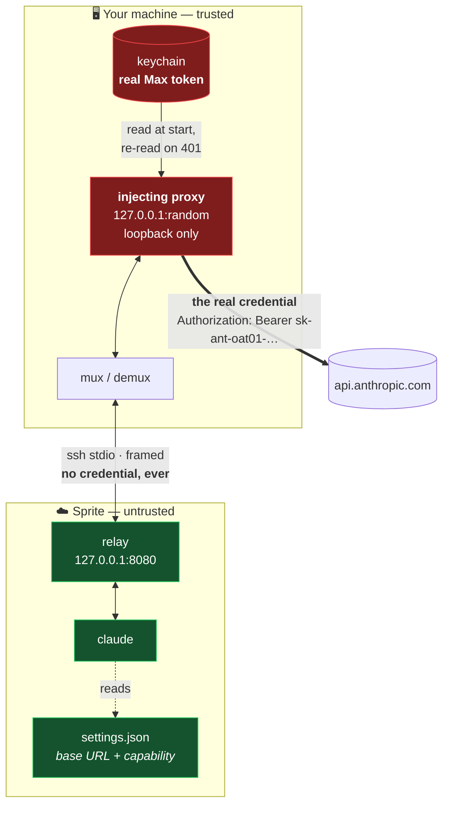
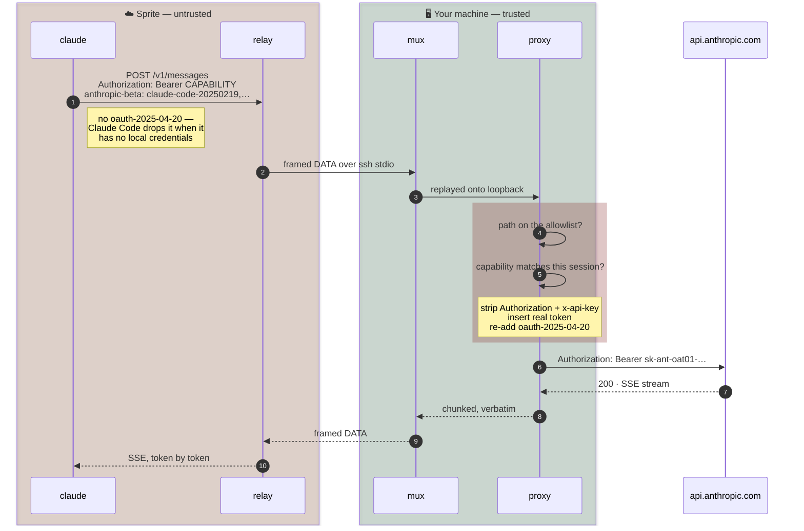
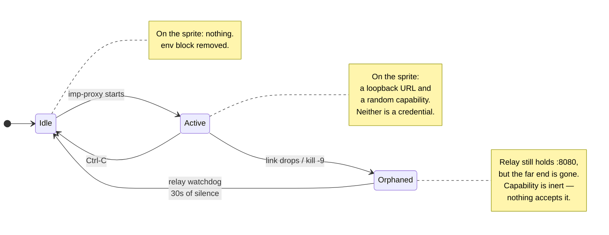
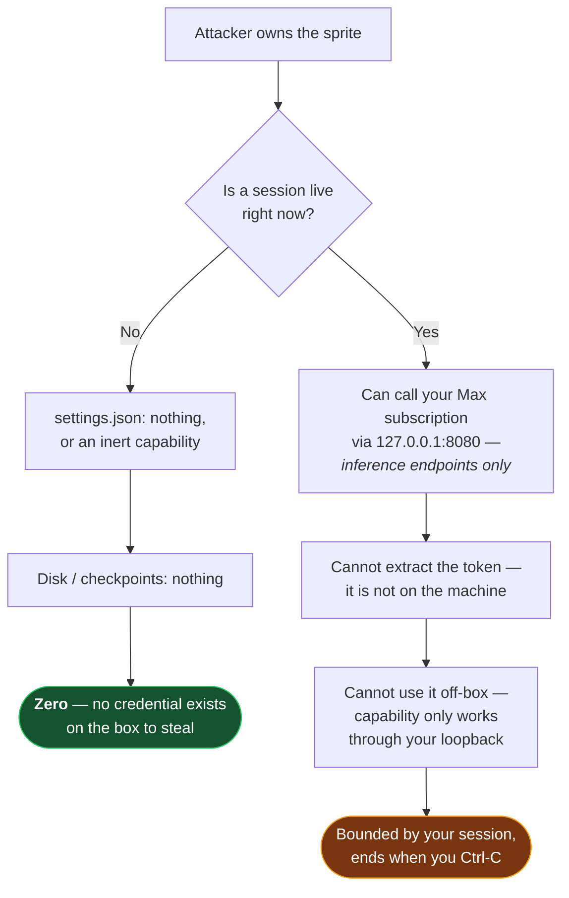

# imp

[](https://github.com/metcalfc/imp/actions/workflows/ci.yml)

Lend a [Fly Sprite](https://docs.sprites.dev) your Claude Max subscription
without ever giving it the credential.

```
imp -s my-sprite
```

A tmux window: a console on the sprite above, the proxy's log in a strip
below. `claude` there now runs on your Max subscription. Ctrl-C the lower pane
— or close the window — and access dies instantly. The sprite never held
anything worth stealing.

`imp` is only sugar for two commands you could type yourself. The one that
matters is `imp-proxy`, which needs no tmux and is a Ctrl-C away as it always
was:

```
imp-proxy -s my-sprite      # then `sprite console` wherever you like
```

*An imp is a small servant you lend out. It does the work, it carries nothing
worth taking, and it goes away when you stop looking at it.*

## Install

Three files, no packaging, no dependencies. Drop them somewhere on your
`PATH`:

```sh
git clone https://github.com/metcalfc/imp.git
cd imp
install -m 755 imp imp-proxy imp-auth /usr/local/bin/
```

| | |
|---|---|
| `imp` | opens the tmux window. Sugar; passes every option through |
| `imp-proxy` | the whole of it — the credential, the tunnel, the allowlist |
| `imp-auth` | mints and stores the token `imp-proxy` reads |

Or run them straight out of the clone — `./imp -s my-sprite` works the same,
and picks up the `imp-proxy` sitting next to it rather than one on your `PATH`.

You need `python3` and the [`sprite` CLI](https://docs.sprites.dev) on your
machine, `tmux` only if you want the window, `python3` on the sprite, and a
Claude Max subscription. Nothing is installed on the sprite: the relay is
shipped as base64 in argv and never touches its disk.

Then either log in with `claude` and go, or mint a dedicated token first —
recommended, and explained under [Credential selection](#credential-selection):

```sh
imp-auth mint          # `claude setup-token`, stored in your keychain
imp -s my-sprite
```

---

## The problem

Sprites ship Claude Code preinstalled but wired for API-key auth. The obvious
fix — push an OAuth token into the sprite's `~/.claude/settings.json` — leaves a
live credential sitting on a remote VM: on disk, in every checkpoint, readable
by anything running there, and still valid long after you've stopped using it.

The obvious *second* fix — scope the token to a tmux session — does not work.
`tmux setenv` only reaches **new** panes, so every `claude` already running has
the token copied into its own `environ`. Revoking would mean `tmux kill-server`,
i.e. killing your work to kill your credential.

## The approach

Keep the credential at home and send requests to it, rather than sending it to
the requests.



🔴 holds the real credential · 🟢 holds nothing worth stealing

**Red never crosses a boundary.** The thick edge — the only one carrying the
real token — runs from your machine straight to Anthropic. The sprite is on a
different edge entirely.

The sprite cannot reach you directly: `sprite proxy --ssh` supports neither `-R`
nor `-A`. So the tunnel is a userspace reimplementation of remote forwarding,
multiplexed over the one ssh stdio channel, which is 8-bit clean in both
directions (verified: 256KB round-tripped byte-identical).

## What crosses the boundary, per request



Steps 4-6 are the whole design. The sprite's request arrives carrying a string that
is worthless anywhere else; it leaves carrying a credential the sprite never
saw. Anthropic's Max entitlement rides on headers **the proxy controls** — the
sprite contributes nothing to it.

> The `oauth-2025-04-20` re-insertion is not cosmetic. With no local OAuth
> credentials, Claude Code omits that beta, and without it the request is not
> honoured against a Max subscription.

## Revocation



There is no watchdog racing a live secret, and no teardown that has to succeed.
Revocation is the *absence* of the proxy. Running `claude` processes on the
sprite simply start failing API calls; reconnect and they resume.

Verified against a live sprite:

| Test | Result |
|---|---|
| `claude -p` through the tunnel | `TUNNEL_OK` — incl. an 83KB request |
| Ctrl-C, then `claude` on the sprite | `Not logged in · Please run /login` |
| clean exit teardown | `NO ENV BLOCK` — settings.json restored |
| closing the terminal or the tmux pane (SIGHUP) | same as a clean exit — settings.json restored |
| `kill -9`, no teardown, 30s later | relay gone, port freed, only an inert capability left |

## Blast radius

What an attacker who fully owns the sprite walks away with:



Contrast with pushing a token into `settings.json`:

| | pushed token | proxy |
|---|---|---|
| credential at rest on the sprite | **yes** | no |
| credential in sprite checkpoints | **yes** | no |
| usable after you disconnect | **yes, indefinitely** | no |
| usable from off the sprite if exfiltrated | **yes** | no |
| revoking costs you | a re-mint everywhere | nothing |
| exposure while connected | full token | proxied calls only |

## Residual risks

Stated plainly, because the diagrams above are about persistence and
exfiltration, not about a live session.

- **While a session is live, any process on the sprite can use your
  subscription.** The capability sits in `settings.json`, world-readable to
  anything running as that user, and the relay listens on the sprite's
  loopback. This is by design — it is the same trust you extend by running
  `claude` there at all — but it is not a sandbox.
- **A live session is worth exactly one thing: inference.** The path allowlist
  below refuses everything else *before* the credential is attached, and a
  `setup-token` credential is inference-only on top of that. Two independent
  limits, but neither stops a hostile sprite from spending your quota.
- **Request and response bodies transit your machine in plaintext**, inside the
  proxy process. They are not logged unless you pass `-v`, which logs method,
  path and byte counts only — never headers or bodies.
- **The sprite-side hop is plaintext HTTP on the sprite's own loopback.** It is
  wrapped in ssh for the whole journey off-box; the cleartext window is the
  sprite's own network stack.

## Path allowlist

The sprite chooses the request path, so without a check the proxy is an open
relay to your account for the length of the session. Allowed by default —
nothing else reaches Anthropic:

```
/v1/messages          /v1/messages/count_tokens          /v1/models   /v1/models/*
```

Anything else is refused with a 403 **before** the real token is attached, and
logged locally:

```
[imp] rejected: path is not on the allowlist (POST /v1/organizations/me)
[imp] rejected: path is not on the allowlist (GET /v1/api_keys)
```

Every rejection carries the method and target that caused it, so a line like

```
[imp] rejected: bad or missing session capability (POST /v1/messages)
```

is legible on sight: that one is a `claude` still holding the capability from a
previous `imp-proxy` session, which is expected once after a restart and
suspicious if
it repeats. The target is the sprite's to choose, so it is reduced to printable
ASCII and clipped at 120 characters before it reaches your terminal.

Request targets are percent-decoded until the decoding stops changing them,
then normalized, and anything whose normal form differs from what was sent is
refused as malformed — otherwise `/v1/messages/../../v1/organizations` would
walk straight past a prefix check, and `%2e%2e` would walk past *that* check by
surviving normalization untouched. Absolute-URL targets, backslashes and
control bytes are refused for the same reason.

**The decoded, normalized target is what gets forwarded.** Authorizing one
spelling and sending another is how an allowlist gets walked past even when
every individual check looks right.

In these patterns `*` matches within a single path segment and `**` spans
segments, so `/v1/models/*` grants one model id rather than everything
underneath it.

Widen it with `--allow`, which takes globs and repeats:

```
imp-proxy -s my-sprite --allow '/v1/messages/batches*'
```

`--allow-any-path` turns the check off entirely. It is the wrong default and
the log says so at startup.

## Several claudes on one sprite

Each `claude` on the sprite is its own stream through the one ssh channel, so
the demultiplexer at each end must never block on any single one of them. It
does not: every stream has its own write queue and writer thread, and the
frame reader only ever hands off.

That matters more than it looks. The frame loop is also what refreshes the
relay's idle timestamp, so a reader wedged on one stalled socket stops the
watchdog's clock — and thirty seconds later the watchdog concludes the
operator is gone and tears down the session. One paused pane would take every
other `claude` with it.

A stream that buffers past 8 MB without draining is dropped on its own; a
`claude` that pauses to render a long response is slow, not stuck, and 8 MB is
a long way past slow.

## Limits

The sprite chooses the numbers in its own requests, so none of them may turn
into an unbounded allocation here. A hostile sprite spending your quota is a
conceded risk; wedging your laptop is not.

| Bound | Default | Why |
|---|---|---|
| request body | 64 MB | `Content-Length` is the sprite's to declare. Checked **after** the capability, so an unauthenticated caller never causes an allocation at all — and a negative or non-numeric value is refused rather than read to EOF |
| tunnel frame | 1 MB | the frame length is a `uint32` from the sprite's stdout; the relay never legitimately sends more than 64 KB |
| concurrent streams | 256 | each `OPEN` costs a socket and a thread on your machine; a repeated stream id closes the socket it replaces rather than leaking it |
| settings.json ssh | 30 s | the sprite decides when that command finishes and how much it prints — teardown must not be something it can hold open |

## Concurrent sessions

Two `imp-proxy` sessions against one sprite on the same remote port already refuse
each other: the second relay cannot bind, so it exits before anything is
written. Only `-p` lets them coexist, and then they contend over one
`settings.json`.

The capability is a unique per-session token, so it doubles as the owner tag:

- **Installing** refuses if a *different* capability is present and something
  is still listening on the port it names. That check runs on the sprite,
  where the answer is a loopback connect.
- **A pointer left by a killed session** has nothing listening behind it, so
  it is taken over silently rather than blocking every future run.
- **Teardown removes only your own.** Stripping `ANTHROPIC_*` unconditionally
  was the half that actually broke the other session.

Redirects are never followed. `urllib`'s default handler copies `Authorization`
into a redirected request without checking the origin, so a `3xx` is passed
back to the sprite verbatim rather than chased with your credential attached.

## Credential selection

Checked in order, first hit wins. Nothing is ever written back.

| Platform | Source |
|---|---|
| macOS | keychain `imp-oauth` — a dedicated `claude setup-token`, **preferred** |
| macOS | keychain `Claude Code-credentials` — your live login |
| Linux | `~/.claude/.credentials.json` |
| Linux | `secret-tool lookup service …` |
| both | `CLAUDE_CODE_OAUTH_TOKEN` in the environment |

Prefer a dedicated `setup-token`: long-lived, inference-only, and revocable
without touching your own login. The live login also works — the proxy re-reads
it on a `401` so a long session survives the access token rolling underneath —
but it is a broader credential than the job needs.

## Usage

```
imp-proxy [-s SPRITE] [-p REMOTE_PORT] [--no-settings]
          [--allow GLOB] [--allow-any-path] [-v]

  -s, --sprite        sprite name (default: the one `sprite use` selected in
                      this directory; without either, it exits and says so)
  -p, --remote-port   port the relay listens on inside the sprite (default 8080)
      --no-settings   don't touch the sprite's settings.json; print the env
                      vars and set them yourself
      --allow GLOB    allow an extra request path through; repeatable
      --allow-any-path  disable the allowlist entirely
  -v, --verbose       log each proxied request (method, path, size)
```

## Tests

Stdlib only, no fixtures to install, no sprite required:

```sh
python3 -m unittest discover -s tests -v
```

They cover the parts the security claims rest on. The path allowlist and
target normalization are exercised directly and over the wire, including
`/v1/messages/../../v1/organizations`. A stand-in upstream records exactly what
crossed the boundary, so "the capability never reaches Anthropic" and "the real
token is attached only after the allowlist passes" are assertions rather than
prose. The relay is run as shipped — base64 through `python3 -c` — and a 256KB
blob of every byte value is round-tripped in both directions to hold the 8-bit
clean claim honest, plus the orphan watchdog is timed out for real to confirm
it frees the port on its own.

`imp-auth` is covered too. It is bash, and it embeds three python programs
that shellcheck cannot see inside, so the tests extract each one and run it
against a temporary HOME standing in for the sprite: the token is installed at
mode 0600, the staged copy is consumed, unrelated settings survive, invalid
JSON is refused, and `remove` replaces `settings.json` by rename rather than
rewriting it in place — asserted by the inode changing, which is the only
thing that actually distinguishes the two.

CI runs them on Linux and macOS against Python 3.9 through 3.13, alongside
`shellcheck` and `bash -n` on `imp` and `imp-auth` — the latter under macOS's
own `/bin/bash` 3.2, which is what `imp` actually has to parse there.

## See also

`imp-auth` in this repo does two jobs. `imp-auth mint` / `store` / `forget`
manage the keychain entry that `imp-proxy` reads — that part you want, and the
Install
section above uses it.

`imp-auth push` is the earlier design: it copies the real token into the
sprite's `settings.json` and leaves it there. It is the right tool only when you
need a sprite to keep working while you are disconnected, and it carries every
row in the left column of the table above.

## License

MIT — see [LICENSE](LICENSE).
