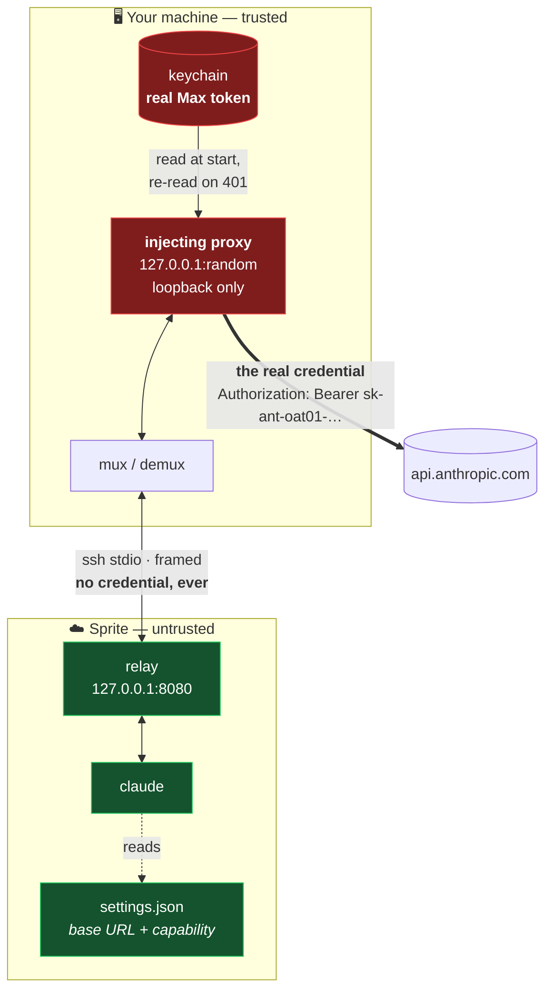
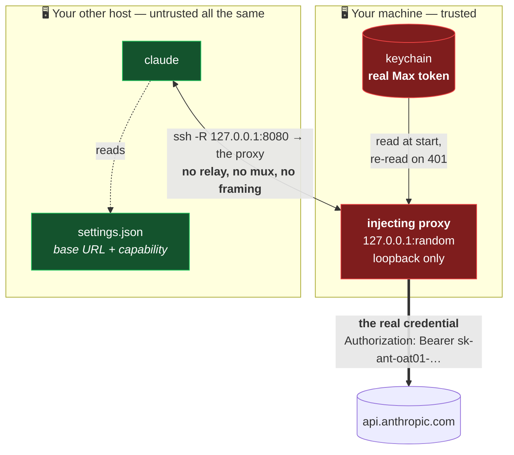
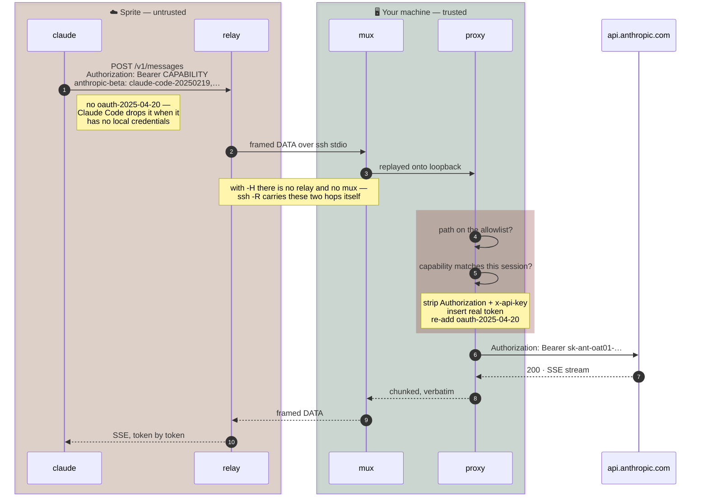
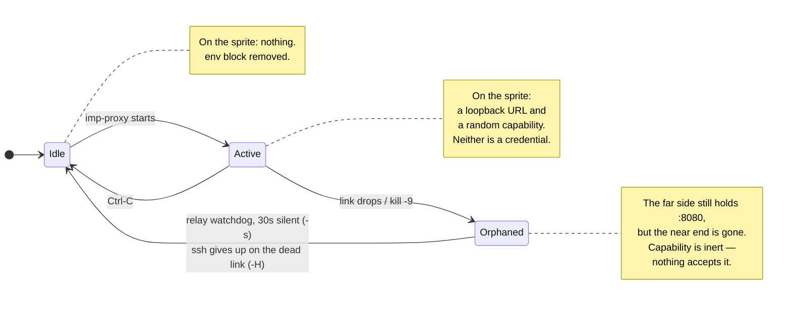

# imp

[](https://github.com/metcalfc/imp/actions/workflows/ci.yml)

Lend a [Fly Sprite](https://docs.sprites.dev) — or any host you can `ssh` to —
your Claude Max subscription without ever giving it the credential.

```
imp -s my-sprite
```

A tmux session, laid out for working in more than one Claude at once:

```
window 0  imp:my-sprite      the proxy, and its log
window 1  claude:my-sprite   a console on the sprite, `claude` running in it
window 2  claude:my-sprite
window 3  claude:my-sprite
```

All three run on your Max subscription. `claude` starts in each one only once
the proxy reports ready — it reads `settings.json` at startup, and that is
what the proxy spends the first second or two writing.

| | |
|---|---|
| `Ctrl-B n` | next window, the proxy included |
| `Ctrl-B C-n` | next **claude** window, stepping over the proxy (`C-p` back) |
| `Ctrl-B T` | every claude in one tiled window — press it again for a window each |

A window each is the right shape for working in one console and the wrong one
for watching three. `Ctrl-B T` joins them into a single tiled window and takes
them back out again, in the same order, and `Ctrl-B z` zooms one of them while
they are together — that part is tmux's own. The proxy keeps its own window
through both: it is what Ctrl-C revokes from, and what notices when the last
console closes.

Ctrl-C the proxy window and access dies instantly — the window goes with it,
leaving the consoles you were working in, now unfunded. Closing the last
console revokes too, and ends the session. The sprite never held anything
worth stealing.

If that Ctrl-C was a mistake, put the proxy back beside the consoles that
outlived it:

```
imp -s my-sprite --reattach
```

They are funded again where they are, mid-conversation, rather than restarted
— see [Ctrl-C you did not mean](#ctrl-c-you-did-not-mean).

`-n` changes how many consoles you get:

```
imp -s my-sprite -n 5
```

`imp` is only sugar for two commands you could type yourself. The one that
matters is `imp-proxy`, which needs no tmux and is a Ctrl-C away as it always
was:

```
imp-proxy -s my-sprite      # then `sprite console` wherever you like
imp-proxy -H my-box         # any ssh destination, ssh_config aliases included
```

*An imp is a small servant you lend out. It does the work, it carries nothing
worth taking, and it goes away when you stop looking at it.*

## Install

Three files, no packaging, no dependencies:

```sh
git clone https://github.com/metcalfc/imp.git
cd imp
make install                      # ~/.local/bin
make install DIR=/usr/local/bin   # or anywhere else
```

That installs `imp` and `imp-proxy`, which are the pair you run every day.
`imp-auth` is a now-and-then tool — mint a token once, forget it exists — so
it stays in the clone unless you ask for it by name:

```sh
make install-auth
```

Never a dependency of `make install`. `imp-auth` mints a long-lived credential
and can write one straight into a sprite's `settings.json` — reach for it on
purpose, not because it arrived on your `PATH` alongside something else.

| | |
|---|---|
| `imp` | lays out the tmux session. Sugar; passes every option through |
| `imp-proxy` | the whole of it — the credential, the tunnel, the allowlist |
| `imp-auth` | mints and stores the token `imp-proxy` reads |

Or run them straight out of the clone — `./imp -s my-sprite` works the same,
and picks up the `imp-proxy` sitting next to it rather than one on your `PATH`.

You need `python3` and the [`sprite` CLI](https://docs.sprites.dev) on your
machine, `tmux` only if you want the windows, `python3` on the sprite, and a
Claude Max subscription. Nothing is installed on the sprite: the relay is
shipped as base64 in argv and never touches its disk.

Then either log in with `claude` and go, or mint a dedicated token first —
recommended, and explained under [Credential selection](#credential-selection):

```sh
./imp-auth mint        # `claude setup-token`, stored in your keychain
imp -s my-sprite
```

---

## The problem

Sprites ship Claude Code preinstalled but wired for API-key auth. The obvious
fix — push an OAuth token into the sprite's `~/.claude/settings.json` — leaves a
live credential sitting on a remote VM: on disk, in every checkpoint, readable
by anything running there, and still valid long after you've stopped using it.

The obvious *second* fix — scope the token to a tmux session — does not work.
`tmux setenv` only reaches **new** panes, so every `claude` already running has
the token copied into its own `environ`. Revoking would mean `tmux kill-server`,
i.e. killing your work to kill your credential.

## The approach

Keep the credential at home and send requests to it, rather than sending it to
the requests.



That is the sprite transport (`-s`); `-H` is the same picture with ssh's own
`-R` where the mux and relay are — [below](#two-transports).

🔴 holds the real credential · 🟢 holds nothing worth stealing

**Red never crosses a boundary.** The thick edge — the only one carrying the
real token — runs from your machine straight to Anthropic. The sprite is on a
different edge entirely.

The sprite cannot reach you directly: `sprite proxy --ssh` supports neither `-R`
nor `-A`. So the tunnel is a userspace reimplementation of remote forwarding,
multiplexed over the one ssh stdio channel, which is 8-bit clean in both
directions (verified: 256KB round-tripped byte-identical).

### Two transports

`-H` targets a host that speaks ordinary ssh, where `-R` does natively what the
relay exists to work around. That path skips the relay entirely — no framing, no
mux, no idle watchdog, and nothing for the far side to run but `echo` and `cat`.
Add `--no-settings` and it needs no `python3` either.



Same two colours, same boundary, one fewer moving part: `:8080` on the far
side is ssh's own listener rather than a process of ours holding the port,
and nothing of imp's runs there but the `cat` that keeps the link open.

Two options carry the properties the relay had by construction:

| | |
|---|---|
| `-R 127.0.0.1:PORT:127.0.0.1:PORT` | spelled out. `-R 8080:…` binds `0.0.0.0` wherever `GatewayPorts yes` is set, which would put the capability endpoint on the network |
| `ExitOnForwardFailure=yes` | otherwise a taken remote port is a warning and a session that silently has no proxy behind it — the relay reports that by failing to bind and never pinging |

Host key checking is left alone for `-H`. Off is right for the sprite, whose
ProxyCommand mints a fresh transport with no stable key to pin; a machine you
own is not that.

Not every host that gives you a shell gives you `-R` — a Go-based ssh server
often implements no remote forwarding at all. One command settles it:

```sh
ssh -R 127.0.0.1:8080:127.0.0.1:9 -o ExitOnForwardFailure=yes HOST 'echo FORWARD_OK'
```

## What crosses the boundary, per request



Steps 4-6 are the whole design. The sprite's request arrives carrying a string that
is worthless anywhere else; it leaves carrying a credential the sprite never
saw. Anthropic's Max entitlement rides on headers **the proxy controls** — the
sprite contributes nothing to it.

> The `oauth-2025-04-20` re-insertion is not cosmetic. With no local OAuth
> credentials, Claude Code omits that beta, and without it the request is not
> honoured against a Max subscription.

## Revocation



There is no watchdog racing a live secret, and no teardown that has to succeed.
Revocation is the *absence* of the proxy. Running `claude` processes on the
sprite simply start failing API calls; reconnect and they resume — which is
literal, and is [the next section](#ctrl-c-you-did-not-mean).

Verified against a live sprite:

| Test | Result |
|---|---|
| `claude -p` through the tunnel | `TUNNEL_OK` — incl. an 83KB request |
| Ctrl-C, then `claude` on the sprite | `Not logged in · Please run /login` |
| clean exit teardown | `NO ENV BLOCK` — settings.json restored |
| closing the terminal or the tmux window (SIGHUP) | same as a clean exit — settings.json restored |
| Ctrl-C in the proxy window | teardown runs, exit 0, and the window closes itself — a window that stays is one that failed |
| closing the last `claude:` window | the proxy window is killed with it, and tears down the same way |

And against a real ssh host (`-H`, Linux, OpenSSH client, Go server):

| Test | Result |
|---|---|
| `claude -p` on the far side | `TUNNEL_OK`, over `-R` with no relay in the process tree |
| settings.json installed | base URL + capability, written over a second ssh |
| Ctrl-C | `settings.json` back to `{}`, forward gone, exit 0 |
| `claude` after Ctrl-C | `Not logged in · Please run /login` |
| `kill -9`, no teardown, 30s later | forward gone, port freed, only an inert capability left |

## Ctrl-C you did not mean

Revoking and losing the proxy by accident are the same keystroke, and the
consoles are the expensive half of a session: three claudes with three
conversations in them, still running, now pointed at a port with nothing
behind it.

Starting another proxy does bring them back, as it turns out: a running
`claude` re-reads `settings.json`, and three consoles picked a new session's
capability up mid-conversation with no restart. That is a behaviour of Claude
Code, though, not something imp can promise on its behalf — so `--reattach`
does not lean on it. It hands back the capability those claudes already have,
and nothing on the far side has to notice that anything changed.

So `imp-proxy` writes the capability down, in
`~/.local/state/imp/<label>-<port>.json`, mode 0600, and `--reattach` hands
the same one back:

```
imp -s my-sprite --reattach
```

That puts a proxy window back in front of the consoles it left, in the tmux
session they are still sitting in. It opens no console and types `claude`
nowhere; the ones running pick the proxy up again on their next request.
Without tmux, `imp-proxy -s my-sprite --reattach` does the funding half by
itself.

What is on disk is not a credential. It names one session, buys nothing
without a proxy of yours listening on the far side's port, and the far side
has held it since the moment it was minted — of everything in this design it
is the one thing that is safe to leave lying around. It is handed back only
when you ask, only within 24 hours, and only if it still looks like something
imp minted; `imp-proxy --clear` takes it out along with the far side's
pointer.

| | |
|---|---|
| the capability | on the far side, in every `claude`'s environment, and now on your disk |
| the credential | on your machine, in your keychain, read per request and never written down |

## Blast radius

What an attacker who fully owns the sprite walks away with:


Contrast with pushing a token into `settings.json`:

| | pushed token | proxy |
|---|---|---|
| credential at rest on the sprite | **yes** | no |
| credential in sprite checkpoints | **yes** | no |
| usable after you disconnect | **yes, indefinitely** | no |
| usable from off the sprite if exfiltrated | **yes** | no |
| revoking costs you | a re-mint everywhere | nothing |
| exposure while connected | full token | proxied calls only |

## Residual risks

Stated plainly, because the diagrams above are about persistence and
exfiltration, not about a live session.

- **While a session is live, any process on the sprite can use your
  subscription.** The capability sits in `settings.json`, world-readable to
  anything running as that user, and the relay listens on the sprite's
  loopback. This is by design — it is the same trust you extend by running
  `claude` there at all — but it is not a sandbox.
- **A live session is worth exactly one thing: inference.** The path allowlist
  below refuses everything else *before* the credential is attached, and a
  `setup-token` credential is inference-only on top of that. Two independent
  limits, but neither stops a hostile sprite from spending your quota.
- **Request and response bodies transit your machine in plaintext**, inside the
  proxy process. They are not logged unless you pass `-v`, which logs method,
  path and byte counts only — never headers or bodies.
- **The sprite-side hop is plaintext HTTP on the sprite's own loopback.** It is
  wrapped in ssh for the whole journey off-box; the cleartext window is the
  sprite's own network stack.

## Path allowlist

The sprite chooses the request path, so without a check the proxy is an open
relay to your account for the length of the session. Allowed by default —
nothing else reaches Anthropic:

```
/v1/messages          /v1/messages/count_tokens          /v1/models   /v1/models/*
```

Anything else is refused with a 403 **before** the real token is attached, and
logged locally:

```
[imp] rejected: path is not on the allowlist (POST /v1/organizations/me)
[imp] rejected: path is not on the allowlist (GET /v1/api_keys)
```

Every rejection carries the method and target that caused it, so a line like

```
[imp] rejected: bad or missing session capability (POST /v1/messages)
```

is legible on sight: that one is a `claude` still holding the capability from a
previous `imp-proxy` session, which is expected once after a restart and
suspicious if
it repeats. The target is the sprite's to choose, so it is reduced to printable
ASCII and clipped at 120 characters before it reaches your terminal.

Request targets are percent-decoded until the decoding stops changing them,
then normalized, and anything whose normal form differs from what was sent is
refused as malformed — otherwise `/v1/messages/../../v1/organizations` would
walk straight past a prefix check, and `%2e%2e` would walk past *that* check by
surviving normalization untouched. Absolute-URL targets, backslashes and
control bytes are refused for the same reason.

**The decoded, normalized target is what gets forwarded.** Authorizing one
spelling and sending another is how an allowlist gets walked past even when
every individual check looks right.

In these patterns `*` matches within a single path segment and `**` spans
segments, so `/v1/models/*` grants one model id rather than everything
underneath it.

Widen it with `--allow`, which takes globs and repeats:

```
imp-proxy -s my-sprite --allow '/v1/messages/batches*'
```

`--allow-any-path` turns the check off entirely. It is the wrong default and
the log says so at startup.

## Several claudes on one sprite

Each `claude` on the sprite is its own stream through the one ssh channel, so
the demultiplexer at each end must never block on any single one of them. It
does not: every stream has its own write queue and writer thread, and the
frame reader only ever hands off.

That matters more than it looks. The frame loop is also what refreshes the
relay's idle timestamp, so a reader wedged on one stalled socket stops the
watchdog's clock — and thirty seconds later the watchdog concludes the
operator is gone and tears down the session. One paused pane would take every
other `claude` with it.

A stream that buffers past 8 MB without draining is dropped on its own; a
`claude` that pauses to render a long response is slow, not stuck, and 8 MB is
a long way past slow.

## How busy is it

Three consoles on one sprite is three test suites on one set of cores, and
when everything is slow the first question is which machine is busy. Usually
not this one — so `imp --meter` is a status-line segment that says:

```
spr  58% mac  11%        one suite running
spr x2.4 mac  11%        three of them, on eight cores
```

`spr` is the sprite the session's consoles are on and `mac` is the machine the
bar is drawn on. `x2.4` is the sprite's run queue over its core count, shown
once it passes 1.25 — and shown *instead of* the percentage, which by then has
nothing left to say: three test suites peg a box at 100% and so does one.

Both fields are four characters wide in every state, including `~58%` for a
reading that has gone stale and `..%` for one that has not arrived. A status
line is read out of the corner of an eye, and a column that shifts whenever a
number does is a column that gets read properly every time. Wire it into
`status-right`:

```tmux
set -g status-right "#(imp --meter #{session_name}) %H:%M"
set -g status-right-length 60
```

tmux expands `#{session_name}` before running the command, so the segment
knows which session it is drawing for; a session that is not one of imp's has
no far side and gets the local number alone.

Both numbers are written down rather than taken fresh each time, and the local
one is cached for a reason that is not cost: recomputed on every draw it moves
on every draw, and a figure that never sits still is one you keep reading.

Nothing in the status line waits on the network. The far side's figure comes
out of a file that a detached sample refreshes at most every 20 seconds, and
the segment only ever reads it — a status job that blocks on ssh blocks every
redraw behind it. Sampling also stops when you stop watching: tmux runs a
status job only for an attached client, so a detached session polls nothing
and leaves the sprite to fall idle rather than poking it awake all afternoon.

| | |
|---|---|
| `IMP_METER_INTERVAL` | seconds between samples of the far side (default 20) |
| `IMP_METER_LOCAL_INTERVAL` | seconds between measurements of this machine (default 15; 0 measures on every draw) |
| `IMP_METER_STYLE` | a tmux style for the segment, e.g. `#[fg=#6e738d]` |
| `IMP_METER_HOT` | a style for the sprite's figure once it is over the threshold |
| `IMP_METER_HOT_AT` | that threshold, as a percentage (default 85) |

Set them where the tmux server will see them, which is `set-environment -g`.

## Limits

The sprite chooses the numbers in its own requests, so none of them may turn
into an unbounded allocation here. A hostile sprite spending your quota is a
conceded risk; wedging your laptop is not.

| Bound | Default | Why |
|---|---|---|
| request body | 64 MB | `Content-Length` is the sprite's to declare. Checked **after** the capability, so an unauthenticated caller never causes an allocation at all — and a negative or non-numeric value is refused rather than read to EOF |
| tunnel frame | 1 MB | the frame length is a `uint32` from the sprite's stdout; the relay never legitimately sends more than 64 KB |
| concurrent streams | 256 | each `OPEN` costs a socket and a thread on your machine; a repeated stream id closes the socket it replaces rather than leaking it |
| settings.json ssh | 30 s | the sprite decides when that command finishes and how much it prints — teardown must not be something it can hold open |

## When a far side says it is busy

There is nothing running on the far side to kill. An imp session is a process
on somebody's machine plus two lines in a `settings.json`, so "stop the other
session" means finding that process, on that machine — and if the session is
already gone, there is nothing to find.

```
imp-proxy --clear -H my-box
```

removes the pointer whoever left it, and says which case you were in:

```
my-box: cleared a pointer we did not own (GHOST-ab...); nothing was listening on it
my-box: cleared a pointer we did not own (PDlgO_cV...); something is STILL listening on it
```

The second line means a session really is live somewhere and you have just
taken the far side away from it — it will keep working until its own proxy
notices, then start failing API calls. There is no registry of far sides, so
`--clear` clears the one you name; "all of them" is a shell loop over the
names you know.

## Concurrent sessions

Two `imp-proxy` sessions against one sprite on the same remote port already refuse
each other: the second relay cannot bind, so it exits before anything is
written. Only `-p` lets them coexist, and then they contend over one
`settings.json`.

The capability is a unique per-session token, so it doubles as the owner tag:

- **Installing** refuses if a *different* capability is present and something
  is still listening on the port it names. That check runs on the sprite,
  where the answer is a loopback connect.
- **A pointer left by a killed session** has nothing listening behind it, so
  it is taken over silently rather than blocking every future run. The check
  runs *before* the link comes up, which is the whole of it: once our own
  forward is listening on that port, the probe reaches us and reports us as
  the incumbent — and a stale pointer would then refuse every future run,
  permanently, with nothing there to go and stop.
- **Teardown removes only your own.** Stripping `ANTHROPIC_*` unconditionally
  was the half that actually broke the other session.

Redirects are never followed. `urllib`'s default handler copies `Authorization`
into a redirected request without checking the origin, so a `3xx` is passed
back to the sprite verbatim rather than chased with your credential attached.

## Credential selection

Checked in order, first hit wins. Nothing is ever written back.

| Platform | Source |
|---|---|
| macOS | keychain `imp-oauth` — a dedicated `claude setup-token`, **preferred** |
| macOS | keychain `Claude Code-credentials` — your live login |
| Linux | `~/.claude/.credentials.json` |
| Linux | `secret-tool lookup service …` |
| both | `CLAUDE_CODE_OAUTH_TOKEN` in the environment |

Prefer a dedicated `setup-token`: long-lived, inference-only, and revocable
without touching your own login. The live login also works — the proxy re-reads
it on a `401` so a long session survives the access token rolling underneath —
but it is a broader credential than the job needs.

## Usage

```
imp-proxy [-s SPRITE | -H HOST] [-p REMOTE_PORT] [--no-settings]
          [--allow GLOB] [--allow-any-path] [--reattach] [-v]

  -s, --sprite        sprite name (default: the one `sprite use` selected in
                      this directory; without either, it exits and says so)
  -H, --host          an ssh destination instead of a sprite -- anything ssh
                      accepts, including a Host from your ssh config
  -p, --remote-port   port to listen on at the far end (default 8080)
      --no-settings   don't touch the far side's settings.json; print the env
                      vars and set them yourself
      --allow GLOB    allow an extra request path through; repeatable
      --allow-any-path  disable the allowlist entirely
      --clear         remove the far side's ANTHROPIC_* pointer, whoever left
                      it, and say whether anything is still behind it
  -n, --consoles      how many console windows `imp` should open (default 3);
                      imp-proxy opens no windows itself and ignores it
      --reattach      reuse the capability the last session on this target
                      held, so `claude` processes still running there are
                      funded again without a restart; `imp --reattach` also
                      puts the proxy window back in the session it was killed
                      out of
  -v, --verbose       log each proxied request (method, path, size)
```

## Tests

Stdlib only, no fixtures to install, no sprite required:

```sh
python3 -m unittest discover -s tests -v
```

`imp` has its own file. It used to have none — it was written off as "a
launcher with nothing at stake" — while it re-implemented argparse's grammar
in bash to decide which console to open, and got every spelling wrong except
the one that got typed by hand: `-sNAME`, `--sprite=NAME` and `--spr NAME`
all reached imp-proxy intact and funded one machine while imp opened a
console on another. It now asks imp-proxy what the arguments meant, and the
tests pin that down along with the window layout, the readiness gate before
`claude` starts, and both directions a session can end. The tmux ones drive a
real tmux on a private socket, and skip themselves where it is missing.

The rest cover the parts the security claims rest on. The path allowlist and
target normalization are exercised directly and over the wire, including
`/v1/messages/../../v1/organizations`. A stand-in upstream records exactly what
crossed the boundary, so "the capability never reaches Anthropic" and "the real
token is attached only after the allowlist passes" are assertions rather than
prose. The relay is run as shipped — base64 through `python3 -c` — and a 256KB
blob of every byte value is round-tripped in both directions to hold the 8-bit
clean claim honest, plus the orphan watchdog is timed out for real to confirm
it frees the port on its own.

`imp-auth` is covered too. It is bash, and it embeds three python programs
that shellcheck cannot see inside, so the tests extract each one and run it
against a temporary HOME standing in for the sprite: the token is installed at
mode 0600, the staged copy is consumed, unrelated settings survive, invalid
JSON is refused, and `remove` replaces `settings.json` by rename rather than
rewriting it in place — asserted by the inode changing, which is the only
thing that actually distinguishes the two.

CI runs them on Linux and macOS against Python 3.9 through 3.13, alongside
`shellcheck` and `bash -n` on `imp` and `imp-auth` — the latter under macOS's
own `/bin/bash` 3.2, which is what `imp` actually has to parse there.

## See also

`imp-auth` in this repo does two jobs. `imp-auth mint` / `store` / `forget`
manage the keychain entry that `imp-proxy` reads — that part you want, and the
Install
section above uses it.

`imp-auth push` is the earlier design: it copies the real token into the
sprite's `settings.json` and leaves it there. It is the right tool only when you
need a sprite to keep working while you are disconnected, and it carries every
row in the left column of the table above.

## License

MIT — see [LICENSE](LICENSE).
